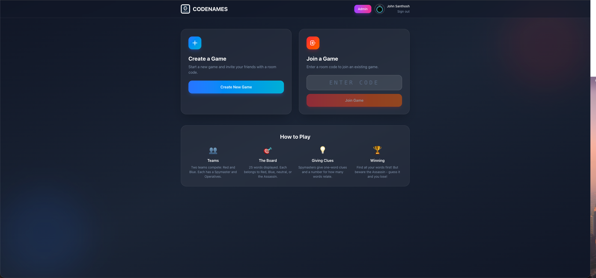
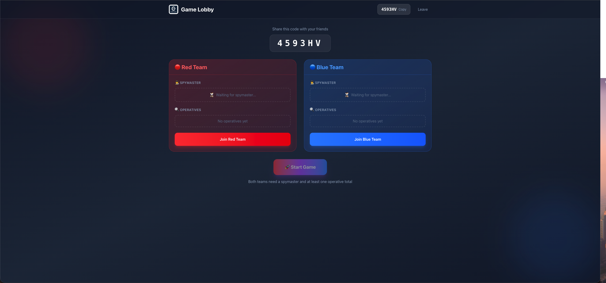
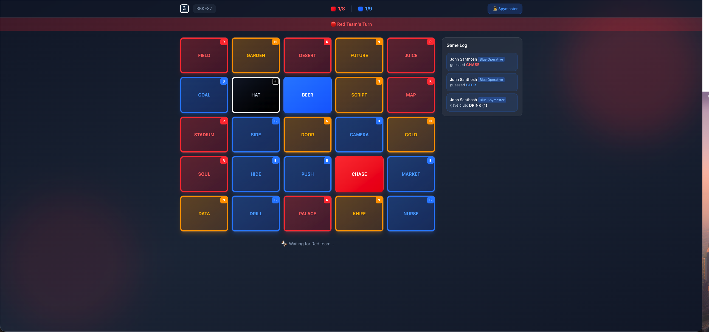

# Codenames

Online multiplayer Codenames game built with React, TypeScript, Firebase, and Tailwind CSS.

## Screenshots

<p align="center">
  
  
</p>
<p align="center">
  
  
</p>

| Screenshot | Description |
|------------|-------------|
| **Home** | Create a new game or join with a room code |
| **Lobby** | Select your team (Red/Blue) and role (Spymaster/Operative) |
| **Game** | The main game board with spymaster view showing card colors |
| **Admin** | Admin dashboard to manage rooms, players, and game state |

## Features

- **Real-time multiplayer** - Play with friends in real-time using Firebase
- **Google Sign-In** - Secure authentication with Google accounts
- **Private rooms** - Create rooms and share codes with friends
- **Admin controls** - Only admins can create games; full admin dashboard (supports multiple admins)
- **Team-based gameplay** - Red vs Blue teams with Spymasters and Operatives
- **Turn-based clues** - Spymasters give clues, operatives guess
- **Win conditions** - Find all words or make opponent hit the assassin
- **Responsive design** - Works on desktop and mobile devices

### Admin Features

- View all active game rooms
- See player lists and game state
- Kick players from rooms
- Reset or end games
- Delete rooms

## How to Play

1. **Create or Join** - Create a new game or join with a room code
2. **Pick Teams** - Choose Red or Blue team
3. **Assign Roles** - One Spymaster per team, others are Operatives
4. **Give Clues** - Spymasters give one-word clues + a number
5. **Guess Words** - Operatives try to find their team's words
6. **Win** - First team to find all their words wins!

## Setup

### Prerequisites

- Node.js 18+
- Firebase project with Realtime Database and Google Auth enabled

### Firebase Setup

See **[SETUP.md](./SETUP.md)** for detailed step-by-step Firebase setup instructions.

### Installation

```bash
# Clone the repository
git clone <your-repo-url>
cd codenames

# Install dependencies
npm install

# Copy environment example and fill in your Firebase config
cp .env.example .env
```

### Environment Variables

Edit `.env` with your Firebase configuration:

```
VITE_FIREBASE_API_KEY=your_api_key
VITE_FIREBASE_AUTH_DOMAIN=your_project.firebaseapp.com
VITE_FIREBASE_DATABASE_URL=https://your_project.firebaseio.com
VITE_FIREBASE_PROJECT_ID=your_project
VITE_FIREBASE_STORAGE_BUCKET=your_project.appspot.com
VITE_FIREBASE_MESSAGING_SENDER_ID=your_sender_id
VITE_FIREBASE_APP_ID=your_app_id

# Admin email(s) - these users can create games and access admin dashboard
# Single admin:
VITE_ADMIN_EMAIL=your_email@gmail.com
# Multiple admins (comma-separated):
VITE_ADMIN_EMAILS=admin1@gmail.com,admin2@gmail.com
```

> **Note:** The admin emails must also be set in your Firebase Database Rules. See [SETUP.md](./SETUP.md) for details.

### Development

```bash
npm run dev
```

Open [http://localhost:5173](http://localhost:5173) in your browser.

### Build

```bash
npm run build
npm run preview
```

## Tech Stack

- **React 19** - UI framework
- **TypeScript** - Type safety
- **Vite** - Build tool
- **Firebase** - Authentication and Realtime Database
- **Tailwind CSS v4** - Styling
- **React Router** - Navigation

## Project Structure

```
src/
├── assets/          # Word list
├── components/      # Reusable components
├── contexts/        # React contexts (Auth)
├── hooks/           # Custom hooks
├── lib/             # Firebase setup
├── pages/           # Page components
├── types/           # TypeScript types
└── utils/           # Utility functions
```

## License

MIT
